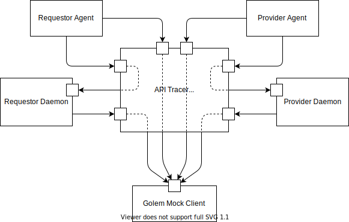

_This is just a stub of a proper README_

# API Calls Tracer

## Prerequsites

* `nginx` (`apt install nginx` should work in recent Ubuntu systems, otherwise see [nginx installation instructions](https://www.nginx.com/resources/wiki/start/topics/tutorials/install/))
* `mitmproxy` (`pip install mitmproxy` should work, otherwise see [mitmproxt installation instructions](https://docs.mitmproxy.org/stable/overview-installation/))

## Starting API Tracer

In the current directory start `nginx` and `mitmproxy` with:
```
$ ./start_proxy.sh
```
This will start or reload `nginx` using the configuration file `./nginx.conf`
and, start `mitmproxy` with the add-on modules `./router_addon.py` and
`tracer_addon.py`, and load sample trace properties from the module `./sample_properties.py`. 

Expected output (you should not worry about the `[alert]` message from `nginx`):
```
Reloading nginx configuration...
nginx: [alert] could not open error log file: open() "/var/log/nginx/error.log" failed (13: Permission denied)
2020/04/25 11:19:39 [notice] 16396#16396: signal process started
Starting mitmproxy...
2020-04-25 11:19:39,949 INFO     [CallTracer] Loading properties from sample_properties
2020-04-25 11:19:39,951 INFO     [CallTracer] 1 properties loaded
2020-04-25 11:19:39,951 INFO     [CallTracer] Tracing started
Loading script ./router_addon.py
Loading script ./tracer_addon.py
Proxy server listening at http://*:9000
```

## Running Level 0 Test Scenario with API Tracer

With API Tracer started (see above) open a terminal in the directory with
test scripts (e.g. [../../test/level0/unix](../../test/level0/unix/)) and start the test with `USE_PROXY` environment variable set:
```
$ USE_PROXY=1 ./run-test.sh
```
Soon after the test starts API Tracer will start logging messages like this:
```
127.0.0.1:36264: clientconnect
2020-04-25 11:48:44,478 DEBUG    [Router] Route message: 15003 (ProviderDaemon) -> 5001 (Market)
2020-04-25 11:48:44,479 INFO     [CallTracer] ProviderDaemon -> Market.POST(/admin/import-key):	sent
127.0.0.1:36264: POST http://127.0.0.1:5001/admin/import-key
              << 200 OK 1b
2020-04-25 11:48:44,498 INFO     [CallTracer] ProviderDaemon -> Market.POST(/admin/import-key):	ok
127.0.0.1:36264: clientdisconnect
127.0.0.1:36272: clientconnect
2020-04-25 11:48:47,186 DEBUG    [Router] Route message: 15001 (RequestorDaemon) -> 5001 (Market)
2020-04-25 11:48:47,187 INFO     [CallTracer] RequestorDaemon -> Market.POST(/admin/import-key):	sent
2020-04-25 11:48:47,192 INFO     [CallTracer] RequestorDaemon -> Market.POST(/admin/import-key):	ok
127.0.0.1:36272: POST http://127.0.0.1:5001/admin/import-key
              << 200 OK 1b
127.0.0.1:36272: clientdisconnect
```

Information on API calls is also written to `calls.log`:
```
2020-04-25 11:48:44,479 1    sent  ProviderDaemon  -> Market           POST   /admin/import-key
2020-04-25 11:48:44,498 1    ok    ProviderDaemon  -> Market           POST   /admin/import-key
2020-04-25 11:48:47,187 2    sent  RequestorDaemon -> Market           POST   /admin/import-key
2020-04-25 11:48:47,192 2    ok    RequestorDaemon -> Market           POST   /admin/import-key
2020-04-25 11:48:50,463 3    sent  ProviderAgent   -> Market           POST   /market-api/v1/offers
2020-04-25 11:48:50,495 3    ok    ProviderAgent   -> Market           POST   /market-api/v1/offers
2020-04-25 11:48:53,285 4    sent  RequestorAgent  -> Market           POST   /market-api/v1/demands
2020-04-25 11:48:53,309 4    ok    RequestorAgent  -> Market           POST   /market-api/v1/demands
2020-04-25 11:48:53,344 5    sent  RequestorAgent  -> Market           GET    /market-api/v1/demands/ca01284f-226f-4243-878e-edf121494f21/events?timeout=5&maxEvents=5
2020-04-25 11:48:53,352 6    sent  RequestorAgent  -> RequestorDaemon  GET    /payment-api/v1/requestor/debitNoteEvents?laterThan=2020-04-25T09%3A48%3A53.264896258%2B00%3A00&timeout=5
2020-04-25 11:48:53,358 7    sent  RequestorAgent  -> RequestorDaemon  GET    /payment-api/v1/requestor/invoiceEvents?laterThan=2020-04-25T09%3A48%3A53.264896258%2B00%3A00&timeout=5
2020-04-25 11:48:53,367 5    ok    RequestorAgent  -> Market           GET    /market-api/v1/demands/ca01284f-226f-4243-878e-edf121494f21/events?timeout=5&maxEvents=5
2020-04-25 11:48:53,418 8    sent  RequestorAgent  -> Market           GET    /market-api/v1/demands/ca01284f-226f-4243-878e-edf121494f21/events?timeout=5&maxEvents=5
2020-04-25 11:48:53,443 9    sent  RequestorAgent  -> Market           POST   /market-api/v1/demands/ca01284f-226f-4243-878e-edf121494f21/proposals/ffeccb19-9cad-416b-a94d-cbc69bba4d89
```

## How does it work

In the regular Level 0 Test Scenario setup, requestor and provider daemons and agents communicate with Mock Golem Client that exposes the Market API on port 5001. Additionally, requestor and provider daemons expose Identity API, Activity API and Payment API for respective agents on ports 6000 and 6001, respectively.

When API tracing is used all communication passes through the API Tracer component. Instead of using port 5001 to access Market API directly, each daemon and agent is assigned a separate port (15001 to 15004) for placing Market API calls via API Tracer. The calls are registered and forwarded to the Mock Golem Client by the API Tracer. 

The agents communicate with their daemons via API Tracer using ports 16000 and 16001.  

This way, each of the six ports exposed by the API Tracer uniquely identifies the callee and the caller.

<p align="center">


Level 0 Test Scenario architecture with API Calls Tracer
</p>

Internally, the API tracer consists of an `nginx` process and an `mitmproxy` process. The former handles HTTP requests on ports 15001 &ndash; 15004, 16000 and 16001, adds `X-Caller` and `X-Callee` headers to each request, based on the port number, and passes the requests to `mitmproxy`'s port 9000. `mitmproxy` uses our custom add-on modules to register HTTP requests and responses and forward the requests to appropriate daemons or the Golem Mock Client.
